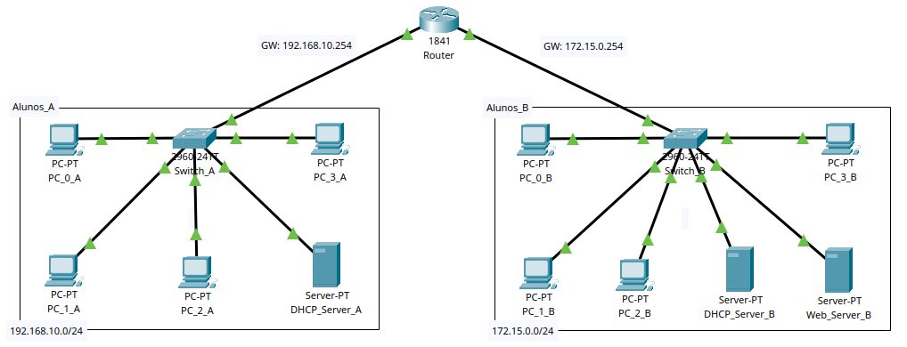

## Comunicação entre 2 Redes no Packet Tracer

## 

Este projeto representa a conexão entre 2 redes de alunos (A e B).

Os desktops da Rede A conseguem colocar, em seus navegadores internos, o endereço do servidor Web que está na Rede B, cuja página `index.html` pode ser carregada corretamente.

O objetivo é validar o roteamento entre as redes.

## Aparelhos 
- 2 switches, um em cada rede;
- 1 roteador, que faz conexão entre as redes;
- 2 servidores DHCP, um em cada rede;
- 4 PCs em cada rede;
- 1 servidor Web na Rede B.

## Como Usar
- Abra o arquivo projeto_redes.pkt no [Cisco Packet Tracer](https://www.netacad.com/cisco-packet-tracer);
- Escolha a opção "Web Browser", na aba "Desktop" de um dos computadores;
- Acesse o endereço `http://www.serverweb2ada.com` - o serviço de DNS foi configurado no servidor DHCP da Rede B.
